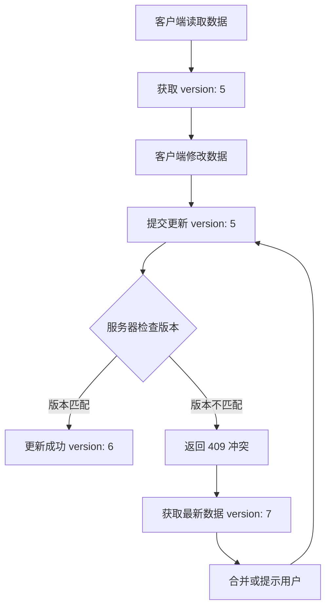

# API 重构设计摘要

## 📋 快速概览

**目标**: 将单一的粗粒度 API 重构为细化的微服务架构，解决数据覆盖、并发冲突和性能问题。

**完整文档**:
- 主文档: [`.agent/api-refactor-design.md`](.agent/api-refactor-design.md)
- 补充文档: [`.agent/api-refactor-design-part2.md`](.agent/api-refactor-design-part2.md)

---

## 🎯 核心改进

### 1. 消除数据覆盖风险
- ❌ 移除危险的 `syncDelete` 参数
- ✅ 使用明确的删除接口 (`DELETE /api/v2/accounts/:id`)
- ✅ 添加版本控制防止误操作

### 2. 解决并发冲突
- ✅ 乐观锁机制（版本号 + 时间戳）
- ✅ 冲突检测和自动重试
- ✅ 提供多种冲突解决策略

### 3. 提高性能
- ✅ 增量查询（`modifiedSince` 参数）
- ✅ 分页支持（`page` + `pageSize`）
- ✅ 字段过滤（`fields` 参数）
- ✅ 批量操作接口

### 4. 改善架构
- ✅ RESTful 微服务模式
- ✅ 清晰的资源边界
- ✅ 标准化错误处理
- ✅ 完善的监控和日志

---

## 🔑 关键 API 端点

### 同步接口（推荐使用）

```http
# 初始化：获取完整快照
GET /api/v2/sync/snapshot

# 后台同步：获取增量变更
POST /api/v2/sync/changes
{
  "lastSyncTime": 1703230000000,
  "resources": ["accounts", "groups", "tags"]
}

# 推送本地变更
POST /api/v2/sync/push
{
  "changes": {
    "accounts": {
      "created": [...],
      "updated": [...],
      "deleted": [...]
    }
  }
}
```

### 账号资源

```http
# 查询账号（支持增量、分页、过滤）
GET /api/v2/accounts?modifiedSince=1703230000000&page=1&pageSize=50

# 创建账号
POST /api/v2/accounts
{
  "id": "account-uuid",
  "email": "user@example.com",
  ...
}

# 更新账号（需要版本号）
PUT /api/v2/accounts/:id
{
  "version": 5,
  "email": "newemail@example.com",
  ...
}

# 批量操作
POST /api/v2/accounts/batch
{
  "operations": [
    { "action": "create", "data": {...} },
    { "action": "update", "data": {...} }
  ]
}
```

### 其他资源

```http
# 分组
GET /api/v2/groups
POST /api/v2/groups
PUT /api/v2/groups/:id
DELETE /api/v2/groups/:id

# 标签
GET /api/v2/tags
POST /api/v2/tags
PUT /api/v2/tags/:id
DELETE /api/v2/tags/:id

# 设置
GET /api/v2/settings
PUT /api/v2/settings/:key
POST /api/v2/settings/batch

# 机器码
GET /api/v2/machine-ids/bindings
PUT /api/v2/machine-ids/bindings/:accountId
```

---

## 📊 版本控制机制

### 数据模型

所有资源都包含版本控制字段：

```typescript
interface VersionedResource {
  version: number;        // 版本号（每次更新递增）
  updatedAt: number;      // 最后更新时间戳（毫秒）
  createdAt?: number;     // 创建时间戳
  deletedAt?: number;     // 删除时间戳（软删除）
}
```

### 乐观锁流程



### 冲突处理示例

```typescript
try {
  await api.v2.accounts.update(id, {
    version: 5,
    email: 'new@example.com'
  });
} catch (error) {
  if (error.error === 'VERSION_CONFLICT') {
    // 获取最新数据
    const latest = await api.v2.accounts.get(id);
    console.log('服务器版本:', latest.version);
    console.log('服务器数据:', latest);

    // 选择策略：
    // 1. 服务器优先：使用 latest
    // 2. 客户端优先：重试更新
    // 3. 手动合并：提示用户
  }
}
```

---

## 🚀 部署步骤

### 前置条件

1. **Node.js 环境**: 确保安装 Node.js 18+ 版本
2. **数据库**: SQLite 数据库文件已存在
3. **依赖安装**: 已运行 `npm install` 或 `pnpm install`

### 步骤 1: 运行数据库迁移

在部署新版本之前，需要先运行数据库迁移脚本，为表添加版本控制字段：

```bash
# 进入服务器目录
cd server

# 运行迁移脚本
node db/migrations/add-version-control.js

# 如果需要回滚
node db/migrations/add-version-control.js --rollback
```

迁移脚本会：
- 为 `accounts`、`groups`、`tags`、`settings` 表添加 `version` 和 `updated_at` 字段
- 创建索引以优化查询性能
- 初始化现有数据的版本号为 1

### 步骤 2: 启动服务器

```bash
# 开发模式
npm run dev

# 生产模式
npm start

# 使用 PM2 集群模式
pm2 start server/cluster.js -i max
```

### 步骤 3: 验证部署

```bash
# 运行 API 测试脚本
node scripts/test-v2-api.js --base-url http://localhost:3000

# 如果启用了认证
node scripts/test-v2-api.js --base-url http://localhost:3000 --token YOUR_TOKEN

# 详细输出模式
node scripts/test-v2-api.js --verbose
```

### 步骤 4: 前端更新

前端代码已自动适配 V2 API：
- Web 模式：使用 `web-adapter.ts` 中的 `loadAccounts` 和 `saveAccounts`
- Electron 模式：使用 `accounts.ts` store 中的同步逻辑

---

## 🧪 测试命令

### 运行完整测试

```bash
# 基本测试
node scripts/test-v2-api.js

# 指定服务器地址
node scripts/test-v2-api.js --base-url http://localhost:3000

# 带认证 Token
node scripts/test-v2-api.js --token YOUR_AUTH_TOKEN

# 详细输出
node scripts/test-v2-api.js --verbose

# 跳过迁移测试
node scripts/test-v2-api.js --skip-migration
```

### 测试覆盖范围

测试脚本验证以下功能：

| 测试项 | 描述 |
|--------|------|
| 健康检查 | `GET /api/health` |
| V1 兼容性 | `GET /api/data` 旧接口仍可用 |
| 同步快照 | `GET /api/v2/sync/snapshot` |
| 增量变更 | `GET /api/v2/sync/changes` |
| 推送变更 | `POST /api/v2/sync/push` |
| 账号列表 | `GET /api/v2/accounts` |
| 账号分页 | 分页参数测试 |
| 账号 CRUD | 创建、读取、更新、删除 |
| 版本冲突 | 409 响应和冲突数据返回 |
| 批量操作 | `POST /api/v2/accounts/batch` |
| 分组 CRUD | 分组的增删改查 |
| 标签 CRUD | 标签的增删改查 |
| 设置 CRUD | 设置的增删改查 |

### 手动测试 API

```bash
# 获取同步快照
curl http://localhost:3000/api/v2/sync/snapshot

# 获取账号列表
curl http://localhost:3000/api/v2/accounts

# 创建账号
curl -X POST http://localhost:3000/api/v2/accounts \
  -H "Content-Type: application/json" \
  -d '{"id":"test-123","email":"test@example.com","idp":"Google"}'

# 更新账号（带版本号）
curl -X PUT http://localhost:3000/api/v2/accounts/test-123 \
  -H "Content-Type: application/json" \
  -d '{"version":1,"nickname":"Test User"}'

# 删除账号
curl -X DELETE http://localhost:3000/api/v2/accounts/test-123
```

---

## ❓ 常见问题解答 (FAQ)

### Q1: 迁移脚本运行失败怎么办？

**A**: 检查以下几点：
1. 确保数据库文件存在且可写
2. 检查是否有其他进程锁定数据库
3. 查看错误日志获取详细信息

```bash
# 检查数据库文件
ls -la data/kiro.db

# 重新运行迁移（会跳过已存在的字段）
node server/db/migrations/add-version-control.js
```

### Q2: 版本冲突 (409) 如何处理？

**A**: 版本冲突表示数据已被其他客户端修改。处理方式：

```typescript
// 方式 1: 自动重试（客户端优先）
async function updateWithRetry(id, data, maxRetries = 3) {
  for (let i = 0; i < maxRetries; i++) {
    try {
      return await api.v2.accounts.update(id, data);
    } catch (error) {
      if (error.error === 'VERSION_CONFLICT') {
        const latest = await api.v2.accounts.get(id);
        data = { ...data, version: latest.version };
      } else throw error;
    }
  }
}

// 方式 2: 服务器优先
if (error.error === 'VERSION_CONFLICT') {
  const serverData = error.serverData;
  // 使用服务器数据覆盖本地
  updateLocalState(serverData);
}

// 方式 3: 手动合并
if (error.error === 'VERSION_CONFLICT') {
  showConflictDialog(localData, error.serverData);
}
```

### Q3: 旧的 /api/data 接口还能用吗？

**A**: 是的，旧接口保持向后兼容。但建议逐步迁移到 V2 API：
- `/api/data` - 仍然可用，但不推荐
- `/api/import` - 仍然可用
- `/api/export` - 仍然可用
- `/api/stats` - 仍然可用

### Q4: 如何启用增量同步？

**A**: 前端已自动支持增量同步。关键代码在 `accounts.ts` store 中：

```typescript
// 获取增量变更
const changes = await apiV2.sync.changes(lastSyncTime);

// 应用变更
if (changes.accounts?.modified) {
  for (const account of changes.accounts.modified) {
    updateLocalAccount(account);
  }
}
```

### Q5: 批量操作有数量限制吗？

**A**: 建议单次批量操作不超过 100 条记录。超过时建议分批处理：

```typescript
const BATCH_SIZE = 100;
for (let i = 0; i < accounts.length; i += BATCH_SIZE) {
  const batch = accounts.slice(i, i + BATCH_SIZE);
  await api.v2.accounts.batch({
    operations: batch.map(acc => ({ action: 'create', data: acc }))
  });
}
```

### Q6: 如何调试 API 请求？

**A**: 使用以下方法：

```bash
# 1. 启用详细日志
DEBUG=* npm run dev

# 2. 使用测试脚本的 verbose 模式
node scripts/test-v2-api.js --verbose

# 3. 检查服务器日志
tail -f logs/server.log
```

### Q7: 前端如何判断使用 V1 还是 V2 API？

**A**: `web-adapter.ts` 会自动处理：
- 优先使用 V2 API
- 如果 V2 失败，自动降级到 V1
- 通过 `console.log` 输出当前使用的 API 版本

### Q8: 数据库迁移是否会丢失数据？

**A**: 不会。迁移脚本只添加新字段，不修改或删除现有数据：
- 新增 `version` 字段，默认值为 1
- 新增 `updated_at` 字段，默认值为当前时间戳
- 创建索引以优化查询

### Q9: 如何回滚到旧版本？

**A**:
1. 回滚数据库迁移：
```bash
node server/db/migrations/add-version-control.js --rollback
```

2. 部署旧版本代码
3. 重启服务器

### Q10: 生产环境部署注意事项？

**A**:
1. **备份数据库**: 在迁移前备份 `data/kiro.db`
2. **停机维护**: 建议在低峰期进行迁移
3. **灰度发布**: 先在测试环境验证
4. **监控**: 部署后密切关注错误日志和性能指标
5. **回滚计划**: 准备好回滚脚本和旧版本代码

---

## 🚀 实施计划

### 阶段 1: 核心功能（2-3 周）⭐ 优先级 P0

**目标**: 解决数据覆盖问题，支持基本增量同步

- [x] 数据库迁移（添加 `version` 和 `updated_at` 字段）
- [x] 实现同步接口
  - `GET /api/v2/sync/snapshot`
  - `GET /api/v2/sync/changes`
  - `POST /api/v2/sync/push`
- [x] 实现账号基础接口（带版本控制）
  - `GET /api/v2/accounts`
  - `POST /api/v2/accounts`
  - `PUT /api/v2/accounts/:id`
  - `DELETE /api/v2/accounts/:id`
- [x] 创建前端适配器层

### 阶段 2: 批量操作（1-2 周）⭐ 优先级 P1

**目标**: 提高批量操作效率

- [x] 批量接口
  - `POST /api/v2/accounts/batch`
  - `POST /api/v2/accounts/batch-delete`
- [x] 分组和标签接口
- [x] 设置接口

### 阶段 3: 高级功能（1-2 周）⭐ 优先级 P2

**目标**: 性能优化和高级功能

- [x] 分页和过滤
- [ ] 机器码接口
- [ ] 导入/导出接口

### 阶段 4: 清理优化（1-2 周）⭐ 优先级 P3

**目标**: 移除旧接口，优化性能

- [ ] 性能优化（缓存、索引）
- [ ] 监控和日志
- [ ] 移除旧接口

**总计**: 5-9 周

---

## 🔄 迁移指南

### 旧代码 (v1)

```typescript
// ❌ 危险：会删除服务器上的其他数据
const data = await api.getData();
await api.saveData({
  ...data,
  accounts: { ...data.accounts, [newId]: newAccount },
  syncDelete: true  // 危险！
});
```

### 新代码 (v2)

```typescript
// ✅ 安全：只创建新账号
await api.v2.accounts.create(newId, newAccount);

// ✅ 安全：明确删除
await api.v2.accounts.delete(accountId, { version: 5 });

// ✅ 高效：增量同步
const changes = await api.v2.sync.changes({
  lastSyncTime: lastSyncTime
});
applyChanges(changes);
```

---

## ⚠️ 重要注意事项

### 1. 始终提供版本号

```typescript
// ✅ 正确
await api.v2.accounts.update(id, {
  version: account.version,
  email: 'new@example.com'
});

// ❌ 错误（会导致版本冲突）
await api.v2.accounts.update(id, {
  email: 'new@example.com'
});
```

### 2. 处理版本冲突

```typescript
async function updateWithRetry(id, data, maxRetries = 3) {
  for (let i = 0; i < maxRetries; i++) {
    try {
      return await api.v2.accounts.update(id, data);
    } catch (error) {
      if (error.error === 'VERSION_CONFLICT') {
        // 获取最新数据并重试
        const latest = await api.v2.accounts.get(id);
        data = { ...latest, ...data, version: latest.version };
      } else {
        throw error;
      }
    }
  }
  throw new Error('更新失败：超过最大重试次数');
}
```

### 3. 使用增量同步

```typescript
// 定期获取增量变更（每 10 秒）
setInterval(async () => {
  const changes = await api.v2.sync.changes({
    lastSyncTime: lastSyncTime
  });

  applyChanges(changes);
  lastSyncTime = changes.serverTime;
}, 10000);
```

### 4. 批量操作优化

```typescript
// ✅ 使用批量接口
await api.v2.accounts.batch({
  operations: accounts.map(acc => ({
    action: 'create',
    data: acc
  }))
});

// ❌ 避免循环调用
for (const acc of accounts) {
  await api.v2.accounts.create(acc);  // 慢！
}
```

---

## 📈 成功指标

### 功能指标
- ✅ 零数据覆盖事故
- ✅ 版本冲突自动解决率 > 90%
- ✅ API 响应时间 P95 < 200ms

### 质量指标
- ✅ 单元测试覆盖率 > 80%
- ✅ 集成测试覆盖率 > 60%
- ✅ API 错误率 < 0.1%

### 用户体验指标
- ✅ 客户端迁移完成率 > 95%
- ✅ 用户满意度 > 4.5/5
- ✅ 支持工单减少 > 50%

---

## 🔗 相关资源

- **完整设计文档**: [`.agent/api-refactor-design.md`](.agent/api-refactor-design.md)
- **补充文档**: [`.agent/api-refactor-design-part2.md`](.agent/api-refactor-design-part2.md)
- **测试脚本**: [`scripts/test-v2-api.js`](../scripts/test-v2-api.js)
- **当前实现**:
  - [`server/routes/sync.js`](../server/routes/sync.js) - V2 同步接口
  - [`server/routes/accounts-v2.js`](../server/routes/accounts-v2.js) - V2 账号接口
  - [`server/routes/groups-v2.js`](../server/routes/groups-v2.js) - V2 分组接口
  - [`server/routes/tags-v2.js`](../server/routes/tags-v2.js) - V2 标签接口
  - [`server/routes/settings-v2.js`](../server/routes/settings-v2.js) - V2 设置接口
  - [`server/routes/data.js`](../server/routes/data.js) - V1 旧接口（向后兼容）
  - [`server/db/migrations/add-version-control.js`](../server/db/migrations/add-version-control.js) - 数据库迁移
- **前端实现**:
  - [`src/renderer/src/lib/api-v2.ts`](../src/renderer/src/lib/api-v2.ts) - V2 API 客户端
  - [`src/renderer/src/lib/web-adapter.ts`](../src/renderer/src/lib/web-adapter.ts) - Web 适配器
  - [`src/renderer/src/store/sync-v2.ts`](../src/renderer/src/store/sync-v2.ts) - 同步状态管理
  - [`src/renderer/src/store/accounts.ts`](../src/renderer/src/store/accounts.ts) - 账号 Store

---

## 📞 联系方式

如有疑问或需要进一步说明，请联系架构团队。

**创建日期**: 2025-12-22
**最后更新**: 2025-12-22
**文档版本**: v1.1
